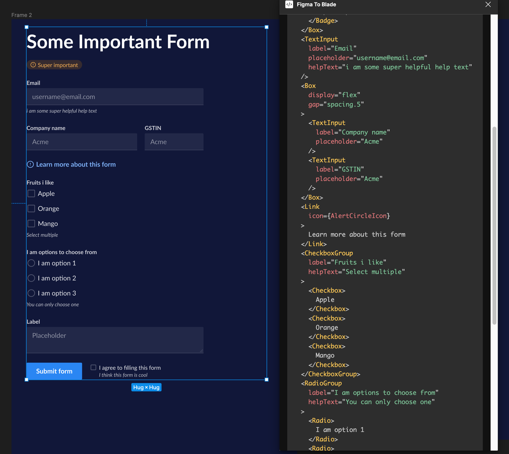
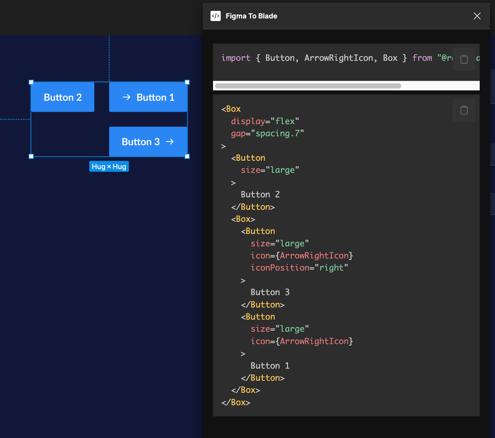
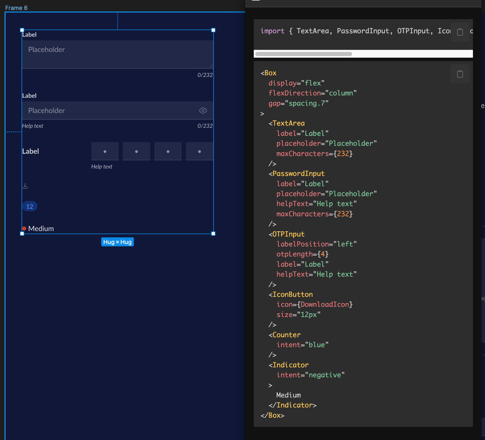

# Razorsharp

> **Warning**
>
> This is alpha software. Things may break and code may not be generated correctly. Please report any issues you find.

Razorsharp is a Figma plugin that generates code for the Blade design system.

    
    
    

## Usage guide

- [Usage guide for developers](docs/usage.md)

## Contributing

Work in progress

## Current status

Will shortly be moving this to GitHub projects. This is a work in progress

| Component     | Status                       |
| ------------- | ---------------------------- |
| Button        | ✅ Done                      |
| Link          | ✅ Done                      |
| CheckboxGroup | ✅ Done                      |
| Checkbox      | ✅ Done                      |
| Text          | ✅ Done                      |
| Title         | ✅ Done                      |
| Heading       | ✅ Done                      |
| RadioGroup    | ✅ Done                      |
| Radio         | ✅ Done                      |
| Badge         | ✅ Done                      |
| Alert         | ✅ Done                      |
| TextInput     | ✅ Done                      |
| Spinner       | ✅ Done                      |
| TextArea      | ✅ Done                      |
| PasswordInput | ✅ Done                      |
| Code          | ✅ Done                      |
| OTPInput      | ✅ Done                      |
| Counter       | ✅ Done                      |
| IconButton    | ✅ Done                      |
| Indicator     | ✅ Done                      |
| Card          |                              |
| ProgressBar   | ✅ Done                      |
| List          |                              |
| SelectInput   | ✅ Done                      |
| Dropdown      |                              |
| ActionList    |                              |
| Layout        | ⚠️ Not yet released by Blade |

## Reporting issues

Create a new GitHub issue or tag @Burhan on #design-system on the Razorpay Slack workspace.

Please include the following information:

- The component that you are trying to generate code for
- Link to the Figma file
- Screenshot of the Figma file and the generated code

## Credits

- The amazing Blade Design System team for creating such a great and consistent design system that made it possible to build this
- [@varunachar](https://twitter.com/varunachar) for the [inspiration of the name for this plugin](https://twitter.com/varunachar/status/1629771631047610371?s=20)

## License

Licensed under the MIT License. See the [LICENSE](LICENSE.md) file for details.
